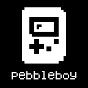

# Pebbleboy



Pebbleboy is a Game Boy and Game Boy Color emulator for Pebble Time 2 and
Pebble 2 Duo. It uses Peanut-GB for the CPU and LCD core and can use a native
16 kHz/16-bit PCM mixer on speaker-equipped watches. The emulator requires the
128 KiB app region on these models, so Pebbleboy only works on Pebble Time 2
and Pebble 2 Duo. Pebble 2 Duo runs GBC games with monochrome output.

Pebbleboy does not contain or distribute commercial Game Boy ROMs. You must
provide ROM images that you are legally entitled to use.

## Release types

Pebbleboy has one emulator build and two ways to deliver a ROM:

| Package | ROM delivery | Firmware |
| --- | --- | --- |
| Loader/ROM chooser | Configure a URL; the phone downloads the selected ROM once and installs it into watch flash | [Pebbleboy CFW](https://github.com/ShinkoNet/PebbleOS/releases) |
| Personal preloaded PBW | Run the Linux build script with a ROM from your own filesystem | [Pebbleboy CFW](https://github.com/ShinkoNet/PebbleOS/releases) |

Both use the same 192-line cache. [Pebbleboy CFW](https://github.com/ShinkoNet/PebbleOS/releases) is currently required for the app-blob
API and speaker fixes.

About audio: Only Pebble Time 2 and Pebble 2 Duo have speakers. The [CFW](https://github.com/ShinkoNet/PebbleOS/releases) includes
speaker and scheduler fixes submitted in [audio PR #2039](https://github.com/coredevices/PebbleOS/pull/2039). You might be able to run
non-CFW builds if you package your own preloaded PBW in the future, if they are added upstream.

## Install and configure

The file `Pebbleboy.pbw` in releases is the ROM-free CFW build and can be shared.
**YOU WILL NEED TO [SIDELOAD THE FIRMWARE](https://github.com/ShinkoNet/PebbleOS/releases) TO RUN IT**

CloudPebble and local SDK builds currently produce the same CFW-compatible
application. Once the required firmware APIs are official, the compatibility
stamp and temporary veneers can be removed without changing the emulator cache.

Anyway...

1. Sideload the [Pebbleboy CFW](https://github.com/ShinkoNet/PebbleOS/releases) and connect the watch to its companion phone.
2. Open Pebbleboy's settings in the Pebble mobile app.
3. Add one or more game names and direct-download ROM URLs (or base64 text URLs).
4. Choose display scaling and whether speaker audio is enabled, then tap
   **Save and launch**. One game starts automatically; multiple games appear in
   the watch menu, where **Up/Down** and **Select** choose a game.
5. The phone transfers the selected ROM once; subsequent launches read it
   directly from watch flash. Opening settings pauses emulation and shows a
   message on the watch until settings closes.

Each URL must return either a binary `.gb`/`.gbc` file or plain base64. Indirect downloads
from random ROM website's won't work. I won't tell you where to find ROMs that
are hosted in this way, unfortunately...

If hosting a distribution URL yourself for your homebrew roms for example, the
host must allow the Pebble phone JavaScript to fetch the URL. HTTPS and an
`Access-Control-Allow-Origin: *` response header are recommended.

The settings editor is hosted at `https://ptv.netcavy.net/gb/`. Existing ROM
names and URLs are passed to it in the URL fragment, which browsers do not send
to the web server. The static source for the page is in `config/index.html`.

The library supports up to 12 entries. One selected ROM is installed on the
watch at a time. The phone may also cache the active download. Each game keeps its own save in watch storage, and saves sync to the phone.
Switching ROMs preserves those saves. Gameplay and saving do not depend on a
Bluetooth connection; see [Loader ROMs and saves](#loader-roms-and-saves) below.

## For nerds

## Where large ROMs live

In the loader build, the phone fetches the selected 32 KB–8 MB cartridge
and transfers it in checked AppMessage chunks. I'm so sorry. [CFW](https://github.com/ShinkoNet/PebbleOS/releases) then stores it
in a filesystem blob owned by Pebbleboy's UUID. This is a CFW-unique app-blob API
to persist and read up to 8 MB from watch flash. The blob is committed only
after its size and CRC32 verify so the transfer knows it got everything.
The emulator then reads cartridge banks locally from flash through its RAM
cache. Installing another game replaces the installed ROM and preserves each game's
separate save; it does not require a new PBW.

In a personal build, the cartridge is packaged as a PBW resource instead. That
PBW is personal to the supplied ROM and has no runtime downloader. It still
uses the same 24 KiB cache and reads ROM and SRAM from flash.

## Firmware and audio

Prebuilt DVT and PVT firmware containing the app-blob API and speaker
scheduling/DMA fixes ([audio PR #2039](https://github.com/coredevices/PebbleOS/pull/2039)) is published from my
[PebbleOS fork](https://github.com/ShinkoNet/PebbleOS/releases). The
[firmware notes](https://github.com/ShinkoNet/PebbleOS/blob/main/PEBBLEBOY_FIRMWARE.md)
explain hardware selection, sideload precautions, source patches, and the
automatic upstream-sync process. Each release contains a merged PBZ with both
firmware slots done by github actions for each upstream release, but feel free
to compile it yourself if you want to feel extra safe after reading the code
yourself :)
I accept no liabilities if my app rewrites something it wasn't supposed to when
loading your ROM into it.

The current Time 2 speaker API accepts Pebbleboy's mono signed 16 kHz/16-bit
PCM format. Disabling audio reduces CPU load so it might improve performance,
but most issues are just a bottleneck from the flash or screen scaling.

## Controls

During a game:

| Pebble input | Game Boy input |
| --- | --- |
| Select button | A |
| Down button | B |
| Up button | Start |
| Back click | Select |
| Touchscreen direction | D-pad |

To toggle best-effort 2× fast-forward, press the Game Boy Start+Select twice
within one second (hold the watch's Up button and double-click Back).
Fast-forward pauses audio until normal speed is restored.

## Build

You need official Pebble SDK 4.33 or newer. To build the universal CFW loader:

```sh
pebble build
```

Linux users can package a ROM from their own filesystem into a personal PBW:

```sh
tools/build-rom.sh /path/to/game.gbc
```

The script uses the normally installed `pebble` command and active official SDK
from `PATH`. It builds in a temporary directory and writes the finished PBW to
`dist/` by default. Pass `--output FILE` to choose another destination.

The unified target supports ROMs up to 8 MB, uses the 24 KiB cartridge cache,
and includes audio.

Please ensure you are allowed to distribute the ROM you bundle with Pebbleboy
if you plan to share your own release.

For low-level development, the equivalent manual embedded-ROM environment is
`PEBBLEBOY_EMBED_ROM=1 pebble build`, with the ROM at
`resources/data/cartridge.gb`.

## Loader ROMs and saves

Each game can have its own save slot. Save in-game as usual; switching games
keeps your saves, and saving works without your phone nearby. Saves sync with
the phone when connected, using the most recent in-game save or import.

- **Import:** Add a save slot and upload a matching `.sav` file (up to 32 KiB).
  It replaces that game's save and loads when you launch the game.
- **Export:** Choose **Export .sav**, copy the download link into Chrome or
  Safari, then tap **Download .sav**.

Export important saves before clearing phone app data or changing phones.

## Credits

The emulator core is based on Peanut-GB by Mahyar Koshkouei and contains
credited MIT-licensed portions from SameBoy. See `src/c/peanut_gb.h` for its
licence and notices.

## Licence

Pebbleboy is distributed under the [MIT License](LICENSE). Third-party
copyright and licence information is collected in
[THIRD_PARTY_NOTICES.md](THIRD_PARTY_NOTICES.md) and retained in the relevant
source files.
